# 🎓 BÀI TẬP LỚN NHÓM 13 MÔN TRÍ TUỆ NHÂN TẠO
## Pacman AI Game - 18 Thuật toán AI

> **🚀 Trải nghiệm game Pacman với 18 thuật toán AI tiên tiến!**

**Nhóm thực hiện:**  
- **Nguyễn Minh Quốc Khánh** - MSSV: 23110113  
- **Nguyễn Hưng Nguyên** - MSSV: 23110135  
- **Nguyễn Bách Tùng** - MSSV: 23110166  

**Lớp:** 251ARIN330585_05CLC  
**Môn học:** Trí tuệ nhân tạo  
**Giảng viên:** Phan Thị Huyền Trang  

---

## 📋 THÔNG TIN BÀI TẬP

### Yêu cầu đề bài:
Triển khai game Pacman với AI sử dụng 18 thuật toán AI khác nhau bao gồm:
- **Tìm kiếm không có thông tin**: BFS, DFS, UCS, IDS, IDL
- **Tìm kiếm có thông tin**: Greedy, A*
- **Tìm kiếm cục bộ**: Hill Climbing, Simulated Annealing, Beam Search
- **Tìm kiếm đối kháng**: Minimax, Alpha-Beta, Expectimax
- **Tìm kiếm tiến hóa**: Genetic Algorithm
- **Tìm kiếm CSP**: Backtracking, Forward Checking, AC-3
- **Tìm kiếm planning**: AND-OR Planning

### Mục tiêu game:
Pacman AI phải di chuyển trong mê cung để:
- Thu thập tất cả dots và power pellets
- Tránh hoặc săn đuổi ghosts (tùy vào power mode)
- Tối đa hóa điểm số và hoàn thành nhiều level
- Thể hiện hiệu quả của từng thuật toán AI

## 🎬 DEMO CHƯƠNG TRÌNH

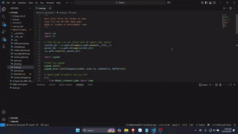

*Minh họa tổng quan gameplay và menu chọn thuật toán AI*

---

## 🚀 HƯỚNG DẪN CHẠY CHƯƠNG TRÌNH

### Bước 1: Kiểm tra yêu cầu hệ thống
```bash
# Kiểm tra Python (cần Python 3.8+)
python --version

# Kiểm tra pip
pip --version
```

### Bước 2: Cài đặt thư viện cần thiết
```bash
# Cài đặt Pygame cho game engine
pip install pygame

# Nếu gặp lỗi, thử:
pip install pygame --upgrade
```

### Bước 3: Tải và giải nén file nộp bài
- Giải nén file ZIP đã nộp
- Mở terminal/command prompt
- Di chuyển tới thư mục chứa code:
```bash
cd "đường_dẫn_tới_thư_mục/cuoi_ky_ttnt"
```

---

## 🎮 CÁCH CHẠY CHƯƠNG TRÌNH

### Option 1: Chạy game trực tiếp (KHUYẾN NGHỊ)
```bash
python main.py
```
- Game sẽ khởi động với giao diện đồ họa
- Sử dụng menu để chọn thuật toán AI
- Quan sát Pacman di chuyển tự động theo thuật toán

### Option 2: Chạy từ thư mục cha
```bash
cd "đường_dẫn_tới_thư_mục_chứa_cuoi_ky_ttnt"
python -m cuoi_ky_ttnt.main
```

### Option 3: Chạy các module riêng lẻ (để test)
```bash
# Test game logic
python game.py

# Test Pacman AI
python pacman.py

# Test sound system
python sound_manager.py
```

---

## 🕹️ CÁCH CHƠI VÀ ĐIỀU KHIỂN

### Điều khiển cơ bản:
- **ESC**: Thoát game
- **SPACE**: Tạm dừng/Tiếp tục
- **M**: Mở menu chọn thuật toán AI
- **R**: Reset level hiện tại
- **N**: Chuyển sang level tiếp theo (nếu hoàn thành)

### Menu thuật toán:
- **Số 1-18**: Chọn thuật toán AI tương ứng
- **Enter**: Xác nhận lựa chọn
- **Backspace**: Quay lại menu

### Gameplay:
- Pacman di chuyển **TỰ ĐỘNG** theo thuật toán đã chọn
- Thu thập dots (●) để tăng điểm
- Ăn power pellets (●) để vào power mode
- Trong power mode: có thể ăn ghosts để bonus điểm
- Tránh ghosts khi không ở power mode

---

## 🧠 18 THUẬT TOÁN AI ĐÃ TRIỂN KHAI

### 🔍 TÌM KIẾM KHÔNG CÓ THÔNG TIN

| STT | Thuật toán | Mô tả & Ưu điểm | Demo |
|-----|------------|-----------------|------|
| 1 | **BFS** - Breadth-First Search | Tìm đường đi ngắn nhất |  |
| 2 | **DFS** - Depth-First Search | Khám phá sâu, tiết kiệm bộ nhớ | 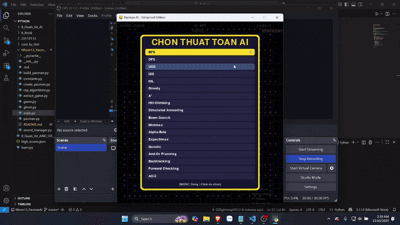 |
| 3 | **UCS** - Uniform Cost Search | Tối ưu chi phí đường đi | 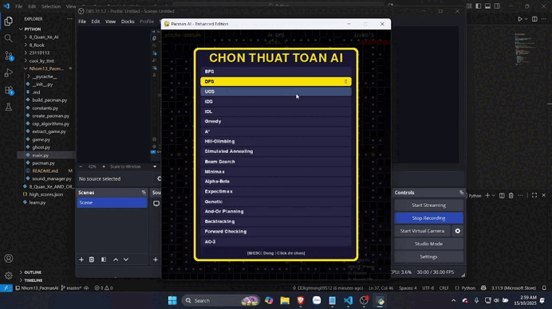 |
| 4 | **IDS** - Iterative Deepening Search | Kết hợp ưu điểm BFS & DFS | 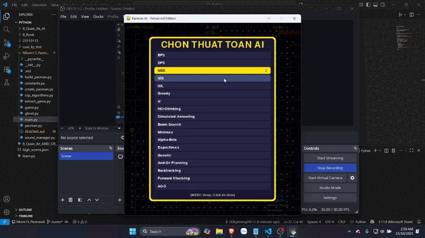 |
| 5 | **IDL** - Iterative Deepening Limited | Giới hạn độ sâu tìm kiếm | 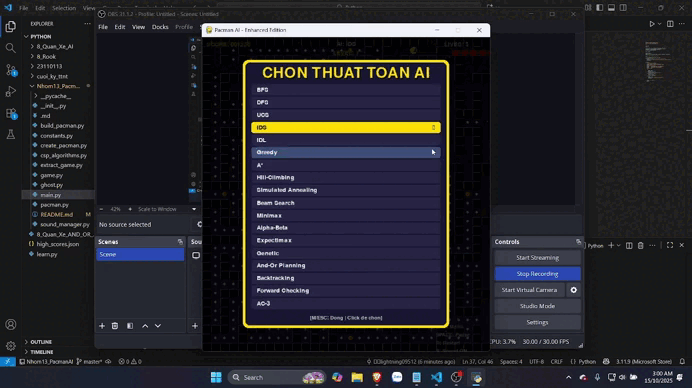 |

### 🎯 TÌM KIẾM CÓ THÔNG TIN

| STT | Thuật toán | Mô tả & Ưu điểm | Demo |
|-----|------------|-----------------|------|
| 6 | **Greedy** - Greedy Best-First | Nhanh nhưng không tối ưu | 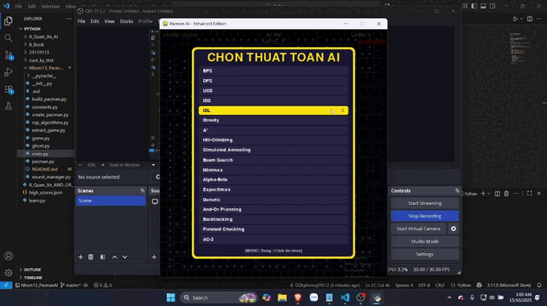 |
| 7 | **A*** - A-star Search | Tối ưu và hiệu quả nhất | 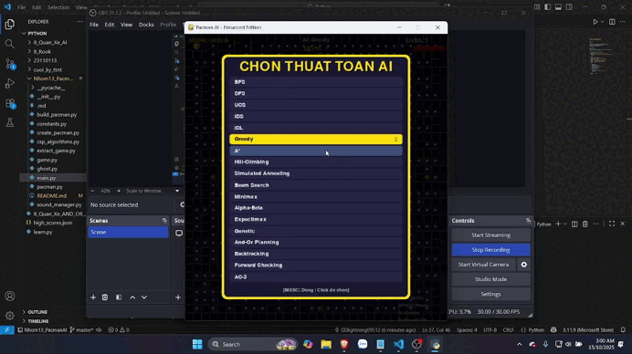 |

### 🏔️ TÌM KIẾM CỤC BỘ

| STT | Thuật toán | Mô tả & Ưu điểm | Demo |
|-----|------------|-----------------|------|
| 8 | **Hill Climbing** | Leo đồi - đơn giản nhưng có thể bị kẹt | 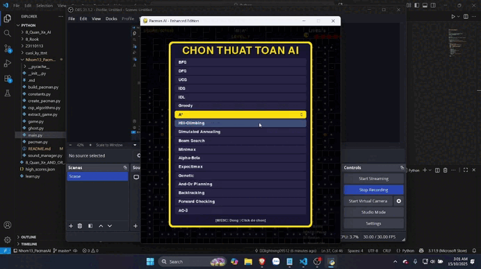 |
| 9 | **Simulated Annealing** | Luyện kim mô phỏng - thoát cực trị | 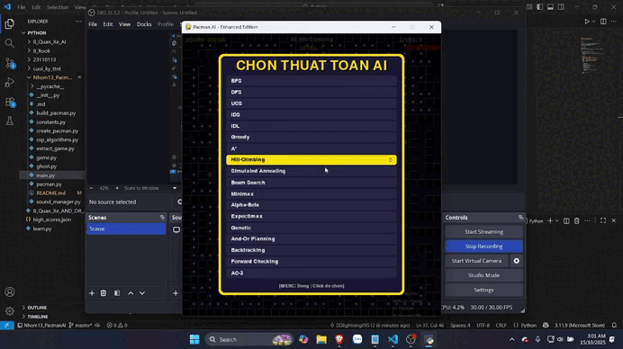 |
| 10 | **Beam Search** | Tìm kiếm chùm - cân bằng tốc độ/chất lượng |  |

### 🎮 TÌM KIẾM ĐỐI KHÁNG

| STT | Thuật toán | Mô tả & Ưu điểm | Demo |
|-----|------------|-----------------|------|
| 11 | **Minimax** | Tối ưu trong game đối kháng | 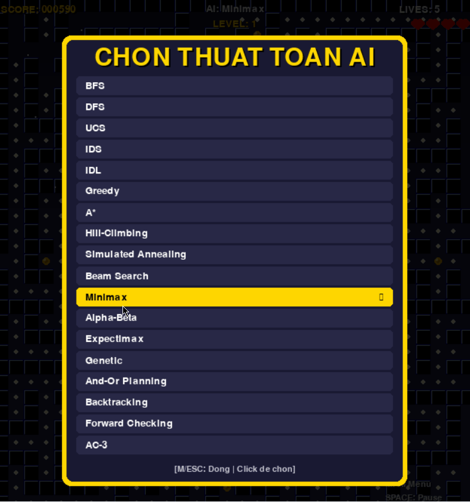 |
| 12 | **Alpha-Beta** | Minimax với cắt tỉa - hiệu quả hơn |  |
| 13 | **Expectimax** | Xử lý yếu tố ngẫu nhiên trong game | 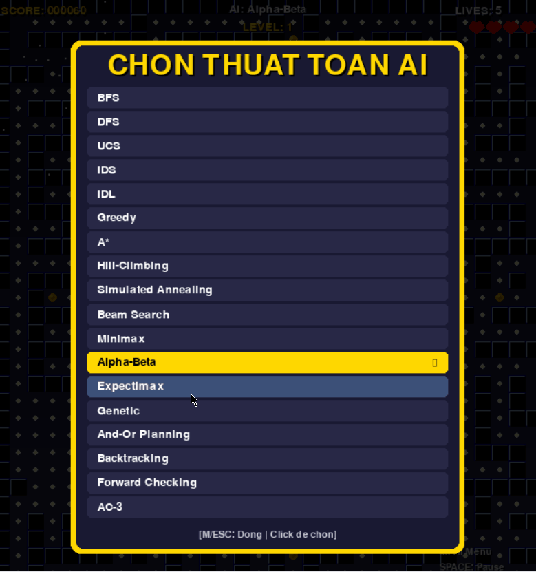 |

### 🧬 TÌM KIẾM TIẾN HÓA

| STT | Thuật toán | Mô tả & Ưu điểm | Demo |
|-----|------------|-----------------|------|
| 14 | **Genetic Algorithm** | Thuật toán di truyền - tối ưu toàn cục | 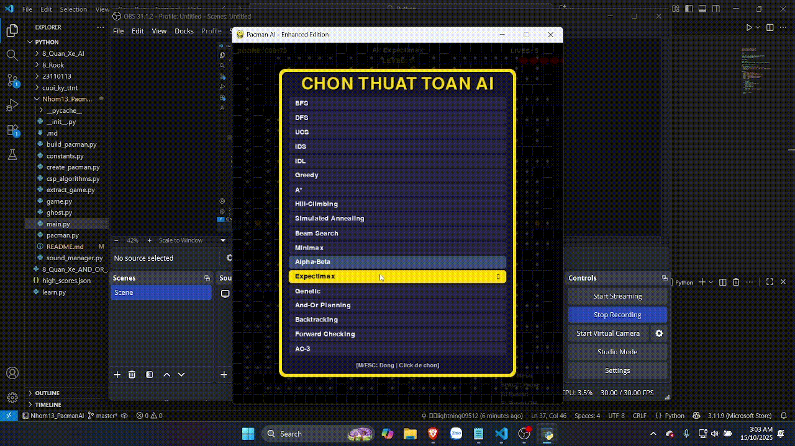 |

### 🔒 TÌM KIẾM CSP (Constraint Satisfaction)

| STT | Thuật toán | Mô tả & Ưu điểm | Demo |
|-----|------------|-----------------|------|
| 15 | **Backtracking** | Quay lui - giải ràng buộc cơ bản | 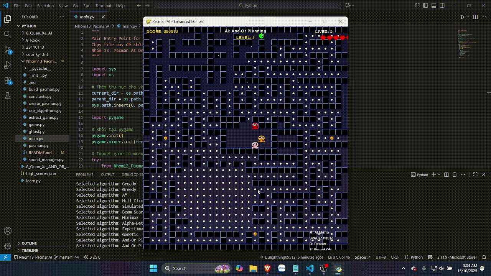 |
| 16 | **Forward Checking** | Kiểm tra tiến - CSP hiệu quả | 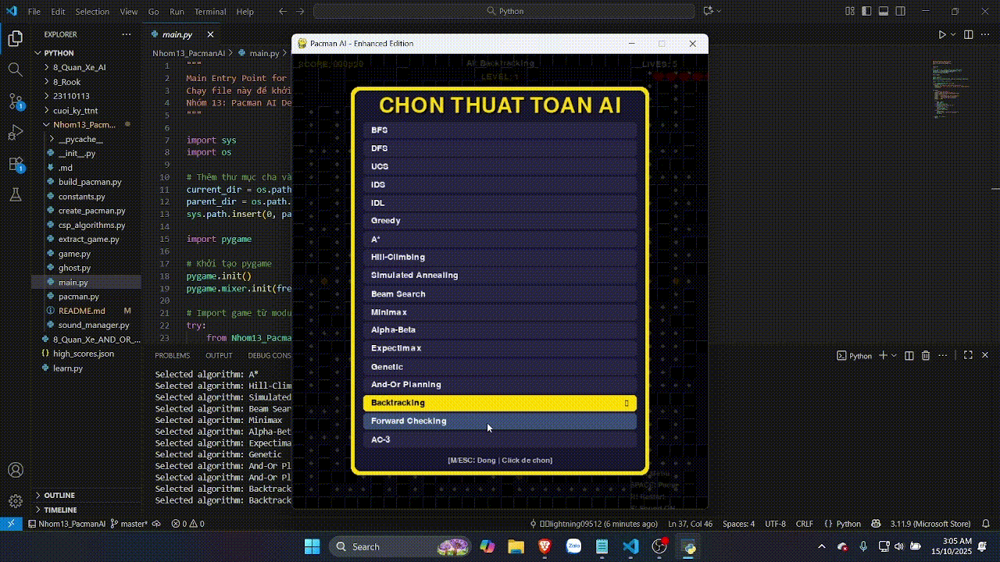 |
| 17 | **AC-3** - Arc Consistency | Giảm miền giá trị, tăng hiệu quả | 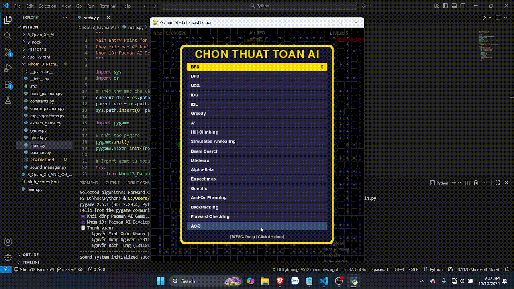 |

### 🌳 TÌM KIẾM PLANNING

| STT | Thuật toán | Mô tả & Ưu điểm | Demo |
|-----|------------|-----------------|------|
| 18 | **AND-OR Planning** | Lập kế hoạch có điều kiện |  |

---

## 🎯 CÁCH ĐÁNH GIÁ VÀ KIỂM TRA

### Test cơ bản:
1. **Chạy game**: `python main.py` - Kiểm tra giao diện khởi động
2. **Menu AI**: Nhấn M - Kiểm tra hiển thị 18 thuật toán
3. **AI hoạt động**: Chọn thuật toán - Pacman di chuyển tự động
4. **Sound**: Kiểm tra âm thanh game (có thể tắt nếu cần)

### Test chi tiết từng thuật toán:
1. **BFS/DFS**: So sánh đường đi và thời gian tìm kiếm
2. **A* vs Greedy**: Đánh giá chất lượng vs tốc độ
3. **Minimax**: Quan sát tương tác với ghosts
4. **Genetic**: Xem quá trình tiến hóa solution

### Metrics đánh giá:
- **Điểm số**: Càng cao càng tốt
- **Thời gian hoàn thành level**: Nhanh hơn = hiệu quả hơn
- **Đường đi**: Ngắn gọn và tối ưu
- **Tương tác với ghosts**: Thông minh trong tránh/săn
- **Dots thu thập**: 100% = hoàn thành level

---

## 📁 CẤU TRÚC FILE CODE

```
Nhom13_PacmanAI/
├── main.py              # File chính để chạy game (team entry point)
├── README.md           # Tài liệu dự án này
├── images/             # Thư mục chứa 19 GIF demo thuật toán
│   ├── A_SAO.gif       # Demo thuật toán A*
│   ├── AC3.gif         # Demo thuật toán AC-3
│   ├── BFS.gif         # Demo thuật toán BFS
│   ├── DFS.gif         # Demo thuật toán DFS
│   ├── Greedy.gif      # Demo thuật toán Greedy
│   ├── Hill.gif        # Demo thuật toán Hill Climbing
│   ├── UCS.gif         # Demo thuật toán UCS
│   ├── alpha.gif       # Demo thuật toán Alpha-Beta
│   ├── and or tree.gif # Demo thuật toán AND-OR Planning
│   ├── backtracking.gif # Demo thuật toán Backtracking
│   ├── beam search.gif # Demo thuật toán Beam Search
│   ├── demo.gif        # Demo tổng quan game
│   ├── expectlmax.gif  # Demo thuật toán Expectimax
│   ├── fowardchecking.gif # Demo thuật toán Forward Checking
│   ├── genetic.gif     # Demo thuật toán Genetic
│   ├── IDS.gif         # Demo thuật toán IDS
│   ├── IDL.gif         # Demo thuật toán IDL
│   ├── minimax.gif     # Demo thuật toán Minimax
│   └── simulated.gif   # Demo thuật toán Simulated Annealing
└── cuoi_ky_ttnt/      # Module game Pacman AI
    ├── main.py              # File chính - entry point của game
    ├── game.py              # Game engine - logic chính của game
    ├── pacman.py            # Pacman AI - 18 thuật toán AI (FILE QUAN TRỌNG)
    ├── ghost.py             # Ghost AI - hành vi của ghosts
    ├── constants.py         # Hằng số, enum, cấu hình game
    ├── sound_manager.py     # Quản lý âm thanh
    ├── csp_algorithms.py    # Thuật toán CSP chuyên biệt
    ├── build_pacman.py      # Utilities để build game
    ├── create_pacman.py     # Tạo các thành phần game
    ├── extract_game.py      # Trích xuất dữ liệu game
    └── README.md           # Tài liệu module core
```

---

## ⚠️ XỬ LÝ LỖI THƯỜNG GẶP

### Lỗi 1: "pygame.error: No available video device"
```bash
# Windows: Cài đặt DirectX
# Linux: Cài đặt SDL development libraries
sudo apt-get install python3-pygame

# Hoặc cài đặt lại pygame
pip uninstall pygame
pip install pygame
```

### Lỗi 2: "ModuleNotFoundError: No module named 'cuoi_ky_ttnt'"
```bash
# Đảm bảo chạy từ đúng thư mục
cd "đường_dẫn_chính_xác_tới_thư_mục_cha"
python -m cuoi_ky_ttnt.main

# Hoặc chạy trực tiếp
cd cuoi_ky_ttnt
python main.py
```

### Lỗi 3: Game chậm hoặc lag
```bash
# Giảm FPS trong constants.py
# Tắt sound nếu cần thiết
# Chạy trên Python 3.8+ để tối ưu hiệu năng
```

### Lỗi 4: Âm thanh không hoạt động
- Kiểm tra driver audio system
- Game vẫn chạy bình thường nếu không có âm thanh
- Có thể comment các dòng sound trong code

---

## 🏆 TÍNH NĂNG NỔI BẬT

### 🎨 Giao diện game:
- **Graphics**: Pixel-perfect Pacman classic style
- **Animation**: Smooth pacman và ghost movement
- **Particle Effects**: Visual feedback cho các hành động
- **UI**: Menu intuitive và thông tin realtime

### 🧠 AI System:
- **18 thuật toán**: Hoàn chỉnh từ cơ bản đến nâng cao
- **Performance metrics**: Thời gian, bước di chuyển, điểm số
- **Adaptive difficulty**: AI thích ứng với level
- **Comparison mode**: So sánh hiệu quả các thuật toán

### 🎵 Audio System:
- **Classic sounds**: Âm thanh Pacman truyền thống
- **Dynamic music**: Thay đổi theo trạng thái game
- **Sound effects**: Feedback cho mọi hành động

### 📊 Analytics:
- **Score tracking**: Lưu high scores
- **Algorithm stats**: Thống kê hiệu suất từng AI
- **Level progression**: Theo dõi tiến độ qua levels

---

## 📈 KẾT QUẢ MONG ĐỢI KHI CHẤM BÀI

### Điểm tối đa nếu:
- ✅ **18 thuật toán hoạt động**: Tất cả AI algorithms work correctly
- ✅ **Game playable**: Chạy mượt mà, không crash
- ✅ **UI/UX tốt**: Giao diện đẹp, dễ sử dụng
- ✅ **Code quality**: Clean code, well-documented
- ✅ **Performance**: AI đưa ra quyết định thông minh
- ✅ **Completeness**: Full features theo yêu cầu

### Điểm cộng cho:
- 🌟 **Visual effects**: Particle systems, animations
- 🌟 **Sound integration**: Complete audio experience
- 🌟 **Multiple levels**: Progressive difficulty
- 🌟 **Algorithm comparison**: Tools để so sánh AI
- 🌟 **Advanced AI**: Sophisticated ghost behaviors
- 🌟 **Code optimization**: Efficient algorithms

### Các thuật toán được đánh giá:
- **Correctness**: Algorithm implementation chính xác
- **Efficiency**: Tốc độ và memory usage
- **Game performance**: Hiệu quả trong game context
- **Code readability**: Dễ hiểu và maintain

---

## 📞 LIÊN HỆ HỖ TRỢ

Nếu gặp vấn đề khi chạy code hoặc cần giải thích thêm về thuật toán:
- **Nhóm 13**: Pacman AI Development Team
- **Email nhóm**: [23110113@student.hcmute.edu.vn]

**Cảm ơn cô đã xem xét bài tập! 🙏**


*Bài tập này được thực hiện với mục đích học tập và nghiên cứu.*

**🎮 CHÚC CÔ CHẤM BÀI VUI VẺ VÀ TRẢI NGHIỆM GAME THÚ VỊ! 🎮**
